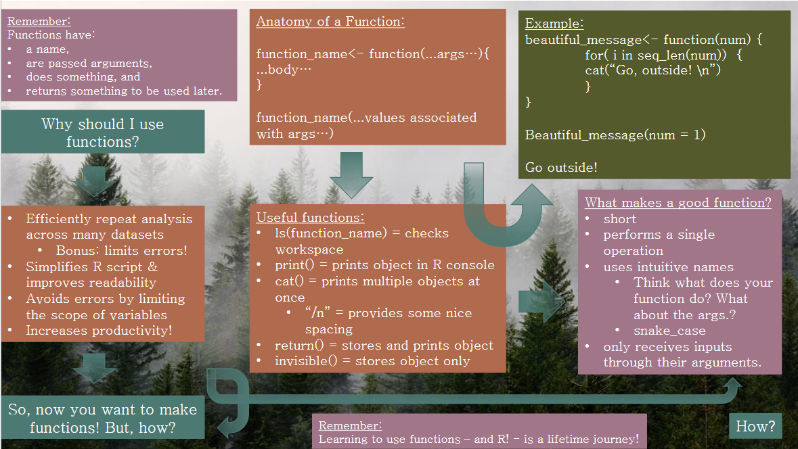

```{r setup, include=FALSE}
knitr::opts_chunk$set(echo = TRUE)
```

# Exercise 1



[Chapter 19 Functions in R for Data Science](https://r4ds.had.co.nz/functions.html)
[Chapter 14 Functions in R Programming for Data Science](https://bookdown.org/rdpeng/rprogdatascience/functions.html)

# Exercise 2

```{r echo=FALSE}
# read in data
Yelloweye <- read.csv('YERockfish.csv')

# create fxn for plotting
Length.Age.Mat <- function(age, length, ...) {
plot(x=age,
y=length,
pch=19,
ylab="Length",
xlab="Age",
...)
}
Length.Age.Mat(age=Yelloweye$age, length=Yelloweye$length, ylim= c(0,80))


```

